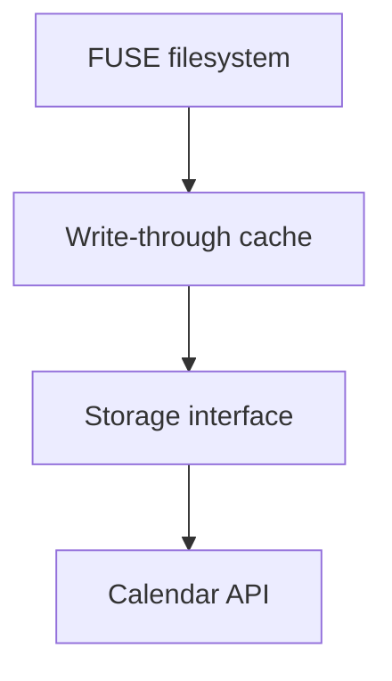

WhenFS turns your Google Calendar into a FUSE filesystem. It whimsically supports the following features:

- Create a filesystem out of existing Google Calendars, or create a new one from scratch
- Read, write and create files and directories
- Mount your friends' WhenFS calendar file systems to share files in the most timely way possible

This is what a filesystem containing a single image of the Mona Lisa looks like when uploaded to Google Calendar:

<p align="center">
  <br>
   .jpg
</p>

<p align="center">
  ⬇️
</p>


The image above is a visual representation of how data can be split up and distributed across hundreds of calendar event descriptions and metadata fields.
The entirety of a WhenFS filesystem—files, directories, reads, writes, attributes and more—is based on manipulating these calendar events.

WhenFS is an example of a [harder drive](http://tom7.org/harder/)—a hard drive we don't want or need.

## (Demo) Mount a Friend's File System

WhenFS can mount existing WhenFS-ed Google Calendars when given the calendar's ID and ID of the file system recovery calendar event:


## (Demo) Transfer Files to Google Calendar

WhenFS can transfer a 3 KiB file to Google Calendar in just over 7 seconds—a blistering upload speed of 400 bytes per second:


## How Does it Work?

WhenFS operations start at the FUSE file system layer, facilitated by [fuser](https://github.com/cberner/fuser). The filesystem sits on top of a write-through object cache, which itself sits on top of an abstract data storage interface with swappable calendar API backends.



If you poke around enough, you'll likely run into bugs, edge cases, and completely unimplemented features. There are no plans to fix these.

## Why Did You Do This?

I used this project as an opportunity to learn about Rust and FUSE file systems. I also think it's hilarious.

Visitors interested in the code should note that this is an irredeemably messy codebase—it's full of hacks, unidiomatic code, and wildly poor design decisions.

However, visitors should also note that that's okay. The best way to learn something new is to try it out for yourself—and creating a mess is a vital part of that process. The page you're on right now is my mess. Now go create yours!

## Usage

The diagram above took too long to create, so I no longer have the energy to write up a tutorial. If you figure out how to use this, let me know.

On a more serious note: Google Calendar is a wonderful service. Users are strongly advised against utilizing WhenFS for storing anything beyond a minimal amount of data or for purposes outside of educational use. 

Abusing a free service is wrong—don't be evil.

## Usage
### Compiling in Docker

If you have docker installed, you can compile with the following command:

```sh
docker run -v `pwd`:/app --workdir="/app" --rm -it rust:1.80 bash -c "apt-get update && apt-get install -y libfuse3-dev && cargo build"
```

When it completes, you will have the binary available at: `target/debug/when-fs`

### Setting Up

Confirm the binary compiled correctly by running `target/debug/when-fs --help`. You should see output like this:

```sh
$ target/debug/when-fs --help
Usage: when-fs [OPTIONS] --secret <SECRET>

Options:
      --mount <MOUNT>            
      --secret <SECRET>          
      --name <NAME>              
      --calendar <CALENDAR>      
      --root-event <ROOT_EVENT>  
  -h, --help                     Print help
```


## Contributions

Contributions are more than welcome.
Note that contributors are subject to a contributor license agreement ("CLA"), which requires that all
contributions be accompanied by a lighthearted meme that makes the author chuckle slightly, but not too much.
